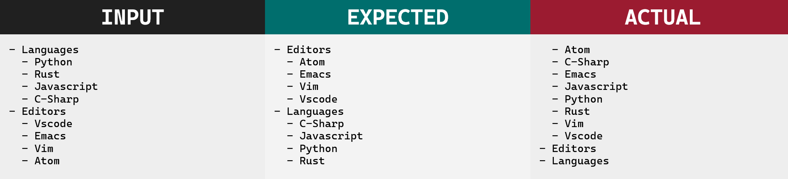
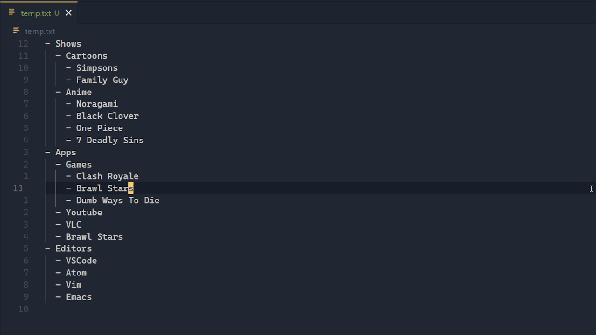
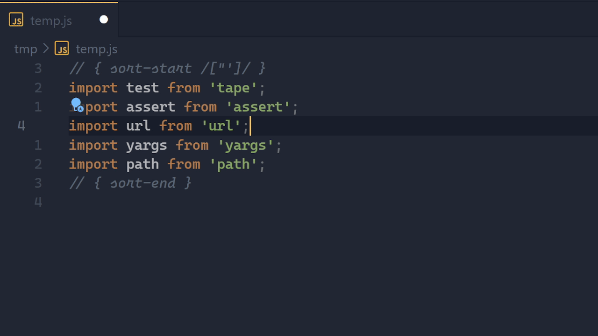

<p align="center">
    
</p>

<p align="center"><b>A feature rich sorter for Visual Studio Code.</b></p>

[](https://marketplace.visualstudio.com/items?itemName=karizma.scoped-sort)
[](https://marketplace.visualstudio.com/items?itemName=karizma.scoped-sort)
[](https://marketplace.visualstudio.com/items?itemName=karizma.scoped-sort)

This is a vscode extension to help sort text & lists in a scoped manner.

# Table of Contents

<!-- prettier-ignore -->
- [Why](#why)
  - [First: Options](#first-options)
  - [Second: Scope](#second-scope)
  - [Disclaimer](#disclaimer)
- [Demos / Previews](#demos--previews)
- [Usage](#usage)
- [Arguments](#arguments)
  - [Regexs](#regexs)
  - [Examples](#examples)
  - [Combinations](#combinations)
- [Configuration](#configuration)
- [Adding Keybindings](#adding-keybindings)
- [Future](#future)
- [Acknowledgements](#acknowledgements)
- [Contributing / Help](#contributing--help)

# Why

Vscode already provides a commands for sorting (`editor.action.sortLinesDescending` and
`editor.action.sortLinesAscending`), and there's tons of extensions for sorting.
So why use this extension?

## First: Options

There's a lot of options you might want, reversing the sort,
case insensitive sort, numeric sort, remove duplicates, etc.

Vscode native commands for sorting don't have many options, other extensions
like [tyriar.sort-lines](https://marketplace.visualstudio.com/items?itemName=Tyriar.sort-lines)
have a lot of options, but they don't have a nice way to combine them, so
they end up polluting the commands contributions with 8+ commands. And even
then they don't allow for all the possibilities. This extension uses a prompt,
so it only needs one command, and can use any combination it has (that makes sense).

This extension also has a lot more options than most sorters, and even has a sort-on-save functionality.

## Second: Scope

Most of these extensions don't consider scope/indentation, so you end up with
an undesired sort.

Here's what I mean:



## Disclaimer

Currently, this extension is not meant for sorting words inside of a line, nor
is it trying to sort language specific things like imports or properties of an
object (although it can sort those if they are simple with regex).

This extension requires a bit of reading to use efficiently. If you are looking
for something simple like just a case-insensitive line sort, other extensions
like [tyriar.sort-lines](https://github.com/Tyriar/vscode-sort-lines) might be
better/easier.

# Demos / Previews

With command:



Sort on save:



If you want to see more demos/previews visit [previews.md](previews.md).

# Usage

There are two commands to this extension. The main functionality is exposed by
the command `scoped-sort.sort` and when saving a text document.

To use the command, first select the text you want to sort, or don't and it'll
sort the entire document. Next go to your command pallete (usually `ctrl+shift+p`),
type 'scoped sort', and select the command. It will then give you a prompt that
allows for arguments, learn more at [#arguments](#arguments).

To use the sort-on-save feature, you need to mark sections with `{ sort-start [arguments] }` and
`{ sort-end }`. The line that marks it, must follow the space format, for example
`{sort-start}` won't work. The text can be anywhere on the line, start, middle,
or end.

Example:

```js
// { sort-start /['"]/ }
import react from 'react';
import express from 'express';
import isIsOdd from 'is-is-odd';
// { sort-end }
```

You can also include the text `{ sort-ignore-file }` (probably want it at the top of the file)
to ignore a whole file.

The other command, `scoped-sort.addSurroundingSortComments` aids the sort-on-save feature.
If you select the below text, and execute the command:

```
3
1
2
```

will turn into (assuming it's not a markdown file)

```
// { sort-start }
3
1
2
// { sort-end }
```

# Arguments

Here's all the arguments:

<!-- prettier-ignore -->
- `s` sort descendingly
- `r` sort recursively
- `e` sort naturally
- `u` remove duplicates
- `i` case insensitive sort & if used with `u`, duplicates are removed case insensitively
- `n` sort by numbers
- `f` sort by floats
- `l` sort by length
- `z` sort randomly
- `m` better sort for markdown lists, for the most part you won't need this, but
in certain cases you will
- `p` combined with regexs, instead of sorting after the matched text, it sorts using the matched text

## Regexs

You can also specify a regex, this will sort using the text _after_ the
match. If you want it to use the matched text, use the argument `p`. Text that
do not match will be left in place, and will be at the top (or bottom if reversed).
Also worth noting, the regex language is **javascript**.

## Examples

Example: `usr` => get unique values, sort descendingly and recursively.

Example: `/title-/` => sort using the text after the text 'title-' in each section/item.

Example: `u /c\w+/ p` => sort using the matched word that starts with c in each
section/item and remove duplicates.

## Combinations

Since this program has a lot of arguments, you might need to know how they combine.
There is no such thing as a fallback sorting here, if two lines are equal in their
sort position, they won't use the second sorter if specified. Example: you might
expect `ln` to work as in, sort by length, if they are equal sort by the number
in that line, but it won't work.

Combinations not already stated:

<!-- prettier-ignore -->
- `m`, `u`, `r` and `s` work on everything
- `/pattern/i`, `/pattern/ i` this doesn't make the regex case insensitive,
it only makes the sort insensitive
- `l /pattern/ p` sorts by the length of the matched text
- `l /pattern/` sorts by the length of the text after the matched part
- `n /pattern/` tries to parse the end of the line as a number
- `np /pattern/` tries to parse the matched text as a number
- `f /pattern/` tries to parse the end of the line as a float
- `fp /pattern/` tries to parse the matched text as a float

Errors:

<!-- prettier-ignore -->
- Mixing sorters (like sort by number and sort by length), `fl`, `fn`, `fz`,
`ln`, `lz`, `nz`, ...
- `e` + regex pattern
- `z` + regex pattern
- `i` when arguments include `n`, `f`, `l`, `e`, or `z` but don't include `u`

# Configuration

All of the configuration is under `scoped-sort`, visit your settings to change them.

`scoped-sort.prompt`: boolean

Decides if the program should always prompt/ask for options when executing the main command.

Default: `true`

`scoped-sort.defaultArgs`: string

This is a string of arguments which follow [#arguments](#arguments). If you have
`scoped-sort.prompt` on, it will insert the string into the prompt, if you have
it off, it will just execute the command with those arguments. Keybindings and
sort-on-save ignore this configuration.

Default: `""`

`scoped-sort.formatSectionsOnSave`: boolean

Decides if the program should format sections on save. Formatting on save only
works when you explicitly define the sections. If you are interested in
keeping the sort-on-save functionality but disable it in a particular file you
should have `{ sort-ignore-file }` (that text has to be somewhere in the line)
at the top.

Default: `true`

# Adding Keybindings

If you are planning to add keybindings, you can add `.args` to provide arguments. This will make it so no prompt shows

For example:

```json
{
    "key": "ctrl+shift+m",
    "command": "scoped-sort.sort",
    "args": "sur"
}
```

Your configuration of `scoped-sort.defaultArgs` is not used here. The reason for
this is that you might have something like `"r"` for your `defaultArgs`, but
want to turn it off for the keybinding. Problem is there is no negation/cancel
of an argument (and there probably won't ever be one).

# Future

Here are some plans for the future, these features might be added in
the future. Some of these features need a more defined api, or I need to know
if people actually want them.

If something has 100%, on it, it will be added for sure, assuming I keep working on this.

<!-- prettier-ignore -->
- Longer argument names, 100%
- Seperate sections with blank lines

  For example you might have some text like this:

  ```text
  Theme: Material Dark
  Link: https://example.com

  Theme: Horizon
  Link: https://example.com

  Theme: Ayu Dark
  Link: https://example.com

  Theme: Atom One Dark
  Link: https://example.com
  ```

- GUI arguments, 100%

  Uses the method `vscode.window.showQuickPick`

- Confirmation `c`, 100%

  This would open up a webview of the transformations and stats,
  you can then confirm if you want to go ahead with the transformation.

- CLI

  - Would allow for piping like the normal unix command
  - You can input a file to sort that file
  - You can input a glob
  - You can sort a specific range
  - You can only sections commented

  ```
  // { sort-start }
  a
  c
  b
  // { sort-end }
  ```


- NPM Package
- Website
- vim/nvim plugin

# Acknowledgements

<!-- prettier-ignore -->
- Theme in the demo is [Ayu Mirage](https://github.com/ayu-theme/vscode-ayu)
- Font in banner is [Ordinary](https://www.dafont.com/ordinary.font)
- Font in previews is [Cascadia Code](https://github.com/microsoft/cascadia-code)

# Contributing / Help

Contributions are very welcome and appreciated.

If you need help with something, found a bug, or want to request a feature,
feel free to make an issue.

If you want to fix a bug or contribute a feature, first create an issue, and
then you can work on a pull request.
