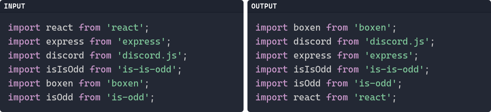
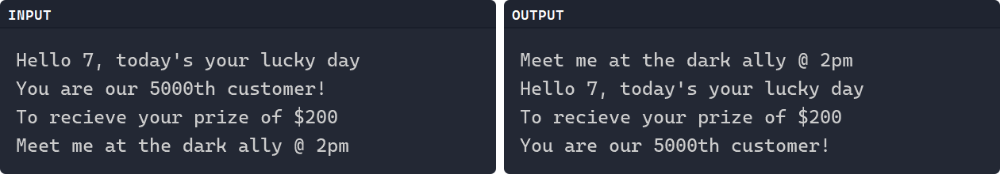
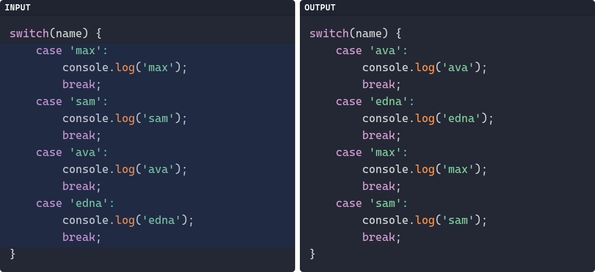
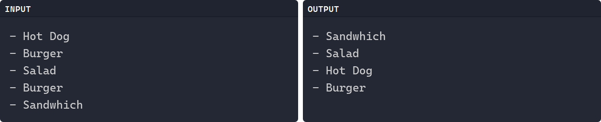

No gifs/vidoes, just showing the transformation that's done. If something is highlighted
in blue, that means it's highlighted inside of vscode before executing the command.

# Sort Imports

Arguments: `/['"]/`

# Sort by Numbers

Arguments: `n`

# Sort Switch Block

Arguments: none

# Sort Reverse & Remove Duplicates

Arguments: `su`

