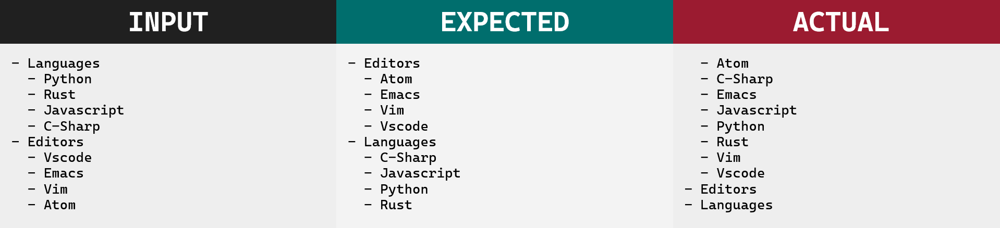
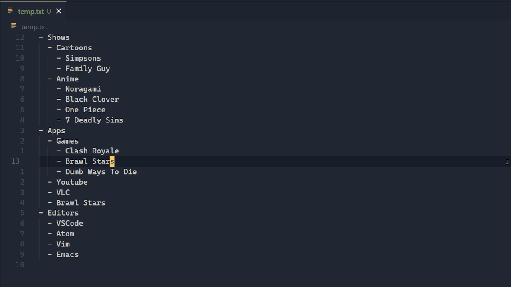

<p align="center">
    
</p>

<p align="center"><b>A feature rich text sorter for Visual Studio Code.</b></p>

[](https://marketplace.visualstudio.com/items?itemName=karizma.scoped-sort)
[](https://marketplace.visualstudio.com/items?itemName=karizma.scoped-sort)
[](https://marketplace.visualstudio.com/items?itemName=karizma.scoped-sort)

This is a vscode extension to help sort text & lists in a scoped manner.

# Table of Contents

<!-- prettier-ignore -->
- [Why](#why)
  - [Options](#first-options)
  - [Scope](#second-scope)
  - [Disclaimer](#disclaimer)
- [Demos / Previews](#demos--previews)
- [Usage](#usage)
- [Arguments](#arguments)
  - [Examples](#examples)
- [Configuration](#configuration)
- [Adding Keybindings](#adding-keybindings)
- [Acknowledgements](#acknowledgements)
- [Contributing / Help](#contributing--help)

# Why

Vscode already provides a commands for sorting (`editor.action.sortLinesDescending` and
`editor.action.sortLinesAscending`), and there's tons of extensions for sorting.
So why use this extension?

## First: Options

There's a lot of options you might want, reversing the sort,
case insensitive sort, numeric sort, remove duplicates, etc.

Vscode native commands for sorting don't have many options, other extensions
like [tyriar.sort-lines](https://marketplace.visualstudio.com/items?itemName=Tyriar.sort-lines)
have a lot of options, but they don't have a nice way to combine them, so
they end up polluting the commands contributions with 8+ commands. And even
then they don't allow for all the possibilities. This extension uses a prompt,
so it only needs one command, and can use any combination it has (that makes sense).

This extension also has a lot more options than most sorters, and even has a sort-on-save functionality.

## Second: Scope

Most of these extensions don't consider scope/indentation, so you end up with
an undesired sort.

Here's what I mean:



## Disclaimer

Currently, this extension is not meant for sorting words inside of a line, nor
is it trying to sort language specific things like imports or properties of an
object (although it can sort those if they are simple with regex).

This extension requires a bit of reading to use efficiently. If you are looking
for something simple like just a case-insensitive line sort, other extensions
like [tyriar.sort-lines](https://github.com/Tyriar/vscode-sort-lines) might be
better/easier.

# Demos / Previews

Command:

Note this example is technically outdated since it uses `re`, which now should
be `-re`.



Sort on save:


If you want to see more demos/previews visit [previews.md](previews.md).

# Usage

There are two commands to this extension. The main functionality is exposed by
the command `scoped-sort.sort` and when saving a text document.

To use the command, first select the text you want to sort, or don't and it'll
sort the entire document. Next go to your command pallete (usually `ctrl+shift+p`),
type 'scoped sort', and select the command. It will then give you a prompt that
allows for arguments, learn more at [#arguments](#arguments).

To use the sort-on-save feature, you need to mark sections with `{ sort-start [arguments] }` and
`{ sort-end }`. The line that marks it, must follow the space format, for example
`{sort-start}` won't work. The text can be anywhere on the line, start, middle,
or end.

Example:

```js
// { sort-start /['"]/ }
import react from 'react';
import express from 'express';
import isIsOdd from 'is-is-odd';
// { sort-end }
```

You can also include the text `{ sort-ignore-file }` (probably want it at the top of the file)
to ignore a whole file.

The other command, `scoped-sort.addSurroundingSortComments` aids the sort-on-save feature.
If you select the text below, and execute the command:

```text
3
1
2
```

will turn into (assuming it's not a markdown file)

```text
// { sort-start }
3
1
2
// { sort-end }
```

Although personally I would advise against using sort-on-save, and instead use the cli version of this project. It uses the same idea of section markers with `{ sort-start }`.

# Arguments

To learn the arguments you should read the [documentation](https://scopedsort.netlify.app/docs)

This program uses flairs in the format of a cli program.

## Examples

Example: `-usr` => get unique values, sort descendingly and recursively.

Example: `--regex /title-/` => sort using the text after the text 'title-' in each section/item.

Example: `-u /c\w+/ -p` => sort using the matched word that starts with c in each
section/item and remove duplicates.

# Configuration

All of the configuration is under `scoped-sort`, visit your settings to change them.

`scoped-sort.prompt`: boolean

Decides if the program should always prompt/ask for options when executing the main command.

Default: `true`

`scoped-sort.defaultArgs`: object

This is an object which defines the default arguments used in situations.
The properties of this object are all strings which follow [#arguments](#arguments).
All the defaults are empty strings.

`scoped-sort.defaultArgs.prompt`: string

When you call the main command, if you have `scoped-sort.prompt` set to true,
this string will be injected into the prompt box.

`scoped-sort.defaultArgs.no-prompt`: string

When you call the main command, if you have `scoped-sort.prompt` set to false,
the command will execute with this value

`scoped-sort.defaultArgs.addSurroundingSortComments`: string

When you call the `addSurroundingSortComments` command, the sort-start comment
will have this value as it's arguments.

For example, if the value was: `--random`, when you use the command on the following text:

```
a
z
b
```

it will turn into

```
// { sort-start --random }
a
z
b
// { sort-end }
```

`scoped-sort.formatSectionsOnSave`: boolean

Decides if the program should format sections on save. Formatting on save only
works when you explicitly define the sections. If you are interested in
keeping the sort-on-save functionality but disable it in a particular file you
should have `{ sort-ignore-file }` (that text has to be somewhere in the line)
at the top.

Default: `true`

# Adding Keybindings

If you are planning on adding keybindings, you can use the `scoped-sort.sort` command. You can also use the `.args` property to provide arguments. This will make it so no prompt shows

For example:

```json
{
    "key": "ctrl+shift+m",
    "command": "scoped-sort.sort",
    "args": "-sur"
}
```

# Acknowledgements

<!-- prettier-ignore -->
- Theme in the demo is [Ayu Mirage](https://github.com/ayu-theme/vscode-ayu)
- Font in banner is [Ordinary](https://www.dafont.com/ordinary.font)
- Font in previews is [Cascadia Code](https://github.com/microsoft/cascadia-code)

# Questions & Contribution

If you need help, found bugs or want to contribute create a github issue.
